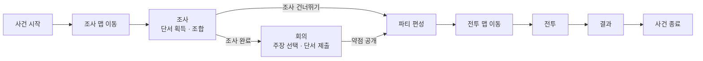
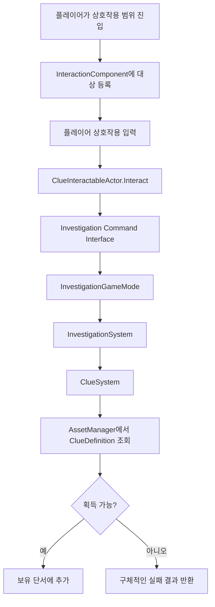

# Project SIH

언리얼 엔진으로 개발 중인 **턴제 추리 게임의 핵심 시스템 구현 코드**를 정리한 저장소입니다.

플레이어가 사건을 조사해 단서를 모으고, 단서를 조합하거나 회의에서 주장에 맞는 증거를 제출한 뒤, 조사 결과를 전투까지 연결하는 흐름을 구현했습니다.

> 이 저장소는 실행 가능한 전체 프로젝트가 아니라, Project SIH에서 직접 구현한 C++ 코드만 분리한 코드 아카이브입니다. 일부 공용 타입, 전투·캐릭터 시스템, 콘텐츠 애셋은 포함되어 있지 않습니다.

## 전체 게임 흐름



`UPFGameFlowSubsystem`이 현재 사건과 페이즈를 보관하며, `GameplayMessageSubsystem`의 Ready/Completed 메시지를 받아 맵 이동 전후의 시스템을 연결합니다. 조사 완료 시에는 획득한 단서가 회의로 전달되고, 회의에서 밝혀낸 약점은 파티 정보와 함께 전투 진입 컨텍스트로 전달됩니다.

## 주요 구현 내용

### 조사 및 단서

- Gameplay Tag 기반 사건·단서 식별
- 단서 획득, 중복 획득 방지, 보유 여부 조회
- 2개 이상의 단서를 사용하는 순서 독립 조합 레시피
- 성공·실패 조합 시도 기록과 동일 실패 조합 재검토 방지
- 구체적인 결과 enum을 통한 실패 원인 구분

### 회의

- `주장 선택 → 단서 제출`의 명시적인 입력 단계 관리
- 보유 단서와 회의 사용 가능 여부 검증
- 주장과 단서의 매칭 결과에 따른 정답/오답 판정
- 정답 단서가 공개한 약점을 누적해 전투 단계로 전달
- 대화 시스템이 회의의 선택 지점과 종료 시점을 결정할 수 있도록 역할 분리

### 상호작용

- 공용 `IPFInteractableInterface` 계약 정의
- 충돌 범위 진입/이탈에 따른 상호작용 대상 등록 및 해제
- `PlayerController`의 컴포넌트에서 현재 대상에게 상호작용 요청 전달
- 단서 액터가 조사 명령 인터페이스를 통해 단서 획득을 요청

### 데이터 및 애셋 관리

- `UPrimaryDataAsset` 기반의 사건·단서 정의
- Gameplay Tag를 `PrimaryAssetId`로 변환해 데이터 조회
- 동기 로드와 타입 검증을 공통 처리하는 커스텀 `AssetManager`
- 단서 조합 레시피, 회의 사용 여부, 반박 대상 주장, 공개 약점을 데이터로 분리

## 단서 상호작용 흐름



## 대표 코드

- [게임 전체 페이즈 관리](./Project_SIH/002_Systems/000_GameFlow/PFGameFlowSubsystem.cpp)
- [조사·회의 시스템 진입점](./Project_SIH/002_Systems/001_Investigation/PFInvestigationGameMode.cpp)
- [단서 획득 및 조합](./Project_SIH/002_Systems/001_Investigation/PFClueSystem.cpp)
- [주장 선택 및 단서 제출](./Project_SIH/002_Systems/001_Investigation/PFMeetingSystem.cpp)
- [범위 기반 상호작용](./Project_SIH/002_Systems/006_Interaction/PFInteractionComponent.cpp)
- [Primary Asset 조회 및 로드](./Project_SIH/001_Data/001_AssetManagement/PFAssetManager.cpp)

## 구조

```text
Project_SIH/
├─ 000_Core/
│  └─ 001_Contracts/001_Investigation/   # 조사·회의 메시지와 결과 타입
├─ 001_Data/
│  ├─ 000_Definitions/                   # 사건·단서 Primary Data Asset
│  └─ 001_AssetManagement/               # 커스텀 AssetManager
└─ 002_Systems/
   ├─ 000_GameFlow/                      # 전체 사건 페이즈와 맵 이동 관리
   ├─ 001_Investigation/                  # 조사·단서·회의 로직과 명령 인터페이스
   └─ 006_Interaction/                    # 범위 기반 공용 상호작용 시스템
```

## 설계 포인트

- **데이터 중심 설계**: 사건, 단서, 조합식과 회의 판정 정보를 코드가 아닌 Data Asset에 정의합니다.
- **인터페이스 기반 연결**: GameMode와 상호작용 액터는 구체 클래스 대신 Entry/Command 인터페이스를 통해 요청을 전달합니다.
- **메시지 기반 페이즈 전환**: 월드가 바뀌어도 유지되는 GameInstance 레벨의 플로우 시스템과 월드별 GameMode를 Gameplay Message로 연결합니다.
- **방어적인 상태 검증**: 잘못된 Gameplay Tag, 현재 페이즈와 맞지 않는 요청, 누락된 에셋, 중복 입력을 각 시스템 경계에서 차단합니다.

## 사용 기술

- Unreal Engine C++
- Gameplay Tags
- Gameplay Message Subsystem
- GameInstance Subsystem
- Primary Data Asset / Asset Manager
- UObject Interface
